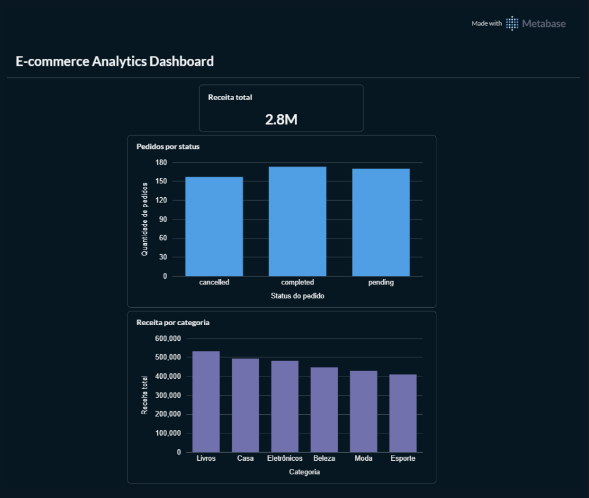
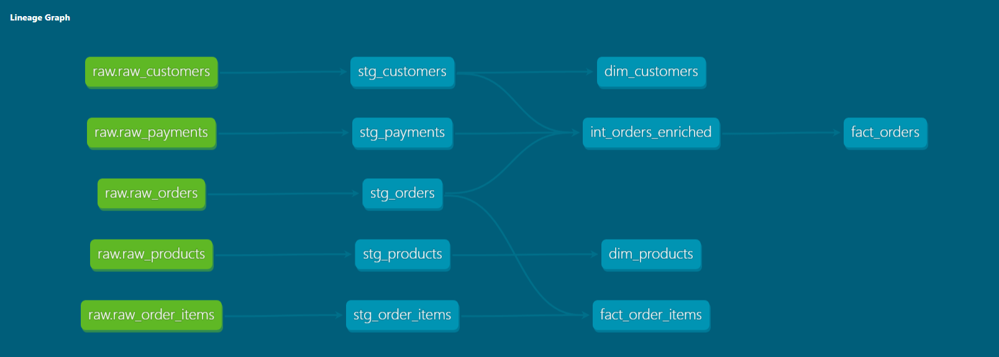
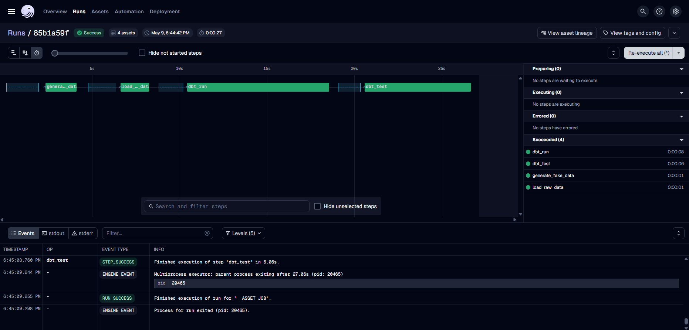
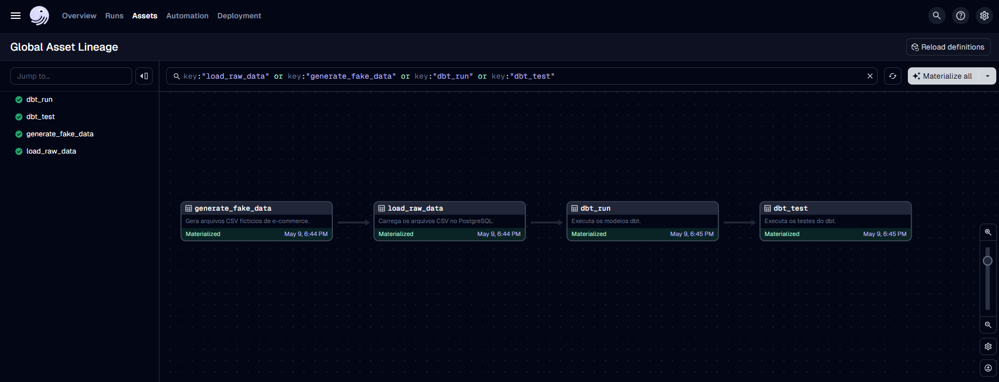

# ecommerce-modern-data-stack
Plataforma analítica local de e-commerce construída com Docker, PostgreSQL, dbt, Dagster e Metabase, demonstrando ingestão de dados, transformação SQL, modelagem dimensional, orquestração e visualização.

# E-commerce Modern Data Stack

Projeto de engenharia de dados que implementa uma plataforma analítica local para dados de e-commerce, utilizando Docker, PostgreSQL, dbt, Dagster e Metabase.

## Objetivo

Construir um pipeline completo de dados, desde a ingestão em camada raw até a criação de modelos analíticos e dashboards.

## Arquitetura

Python → PostgreSQL Raw → dbt Staging → dbt Intermediate → dbt Marts → Metabase

## Stack

- Python
- PostgreSQL
- dbt
- Dagster
- Docker
- Metabase
- GitHub Actions

## Conceitos demonstrados

- ETL/ELT
- Data Modeling
- Star Schema
- Data Quality
- Data Orchestration
- Data Visualization
- Containerization
- CI/CD

## Project Screenshots

### Metabase Dashboard

The dashboard was built using the final marts created by dbt.

It includes:
- Total revenue
- Orders by status
- Revenue by product category

---

### dbt Lineage

The dbt documentation shows the data lineage from raw sources to staging, intermediate and marts models.

---

### Dagster Pipeline

Dagster orchestrates the full data pipeline, running data generation, raw ingestion, dbt transformations and dbt tests.

---

### Dagster Asset Lineage

The Dagster asset lineage shows the dependency flow between each pipeline step.

